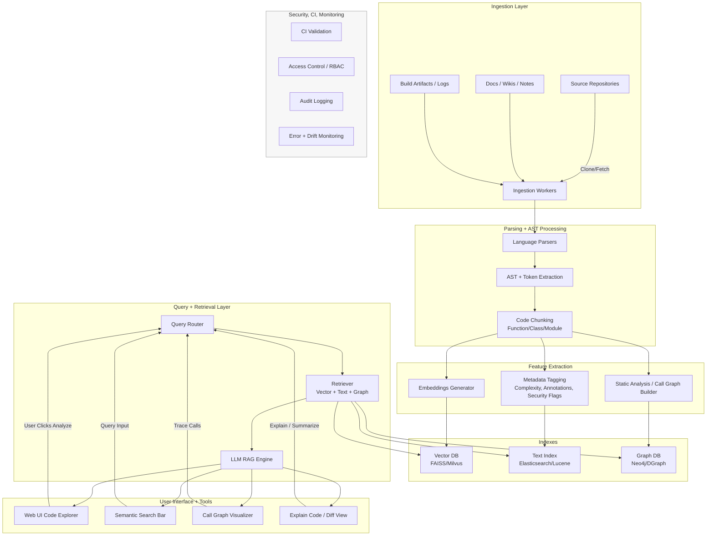

## Reverse engineering architecture diagram

```mermaid
flowchart TB

    %% =============================
    %% LAYERS
    %% =============================
    subgraph Ingestion [Ingestion Layer]
        A1[Source Repositories] -->|Clone/Fetch| A2[Ingestion Workers]
        A3[Docs / Wikis / Notes] --> A2
        A4[Build Artifacts / Logs] --> A2
    end

    subgraph Parsing [Parsing + AST Processing]
        B1[Language Parsers] --> B2[AST + Token Extraction]
        B2 --> B3[Code Chunking\nFunction/Class/Module]
    end

    subgraph Features [Feature Extraction]
        C1[Embeddings Generator]
        C2[Static Analysis / Call Graph Builder]
        C3[Metadata Tagging\nComplexity, Annotations, Security Flags]
    end

    subgraph Indexing [Indexes]
        D1[Vector DB\nFAISS/Milvus]
        D2[Text Index\nElasticsearch/Lucene]
        D3[Graph DB\nNeo4j/DGraph]
    end

    subgraph Query [Query + Retrieval Layer]
        E1[Query Router]
        E2[Retriever\nVector + Text + Graph]
        E3[LLM RAG Engine]
    end

    subgraph UI [User Interface + Tools]
        F1[Web UI Code Explorer]
        F2[Semantic Search Bar]
        F3[Call Graph Visualizer]
        F4[Explain Code / Diff View]
    end

    subgraph Ops [Security, CI, Monitoring]
        G1[CI Validation]
        G2[Access Control / RBAC]
        G3[Audit Logging]
        G4[Error + Drift Monitoring]
    end

    %% =============================
    %% DATA FLOWS
    %% =============================

    A2 --> B1
    B3 --> C1
    B3 --> C2
    B3 --> C3

    C1 --> D1
    C2 --> D3
    C3 --> D2

    E1 --> E2
    E2 --> D1
    E2 --> D2
    E2 --> D3
    E2 --> E3

    E3 --> F1
    E3 --> F2
    E3 --> F3
    E3 --> F4

    F1 -->|User Clicks Analyze| E1
    F2 -->|Query Input| E1
    F3 -->|Trace Calls| E1
    F4 -->|Explain / Summarize| E1

    Ops:::grey
    style Ops fill:#f7f7f7,stroke:#999,color:#333

```