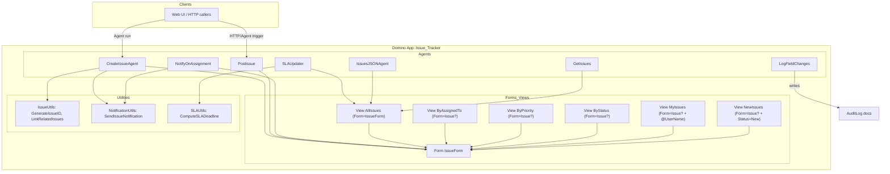

## Architecture Diagram (Mermaid)

```mermaid
flowchart TD
  subgraph Clients
    C1["Web UI / HTTP callers"]
  end

  subgraph Domino_App["Domino App: Issue_Tracker"]
    subgraph Forms_Views
      F1["Form IssueForm"]
      VAll["View AllIssues (Form=IssueForm)"]
      VAssn["View ByAssignedTo (Form=Issue?)"]
      VPrio["View ByPriority (Form=Issue?)"]
      VStat["View ByStatus (Form=Issue?)"]
      VMy["View MyIssues (Form=Issue? + @UserName)"]
      VNew["View NewIssues (Form=Issue? + Status=New)"]
    end

    subgraph Utilities
      UIssue["IssueUtils: GenerateIssueID, LinkRelatedIssues"]
      UNotif["NotificationUtils: SendIssueNotification"]
      USLA["SLAUtils: ComputeSLADeadline"]
    end

    subgraph Agents
      ACreate["CreateIssueAgent"]
      APost["PostIssue"]
      ANotify["NotifyOnAssignment"]
      ASLA["SLAUpdater"]
      AJSON["IssuesJSONAgent"]
      AGet["GetIssues"]
      ALog["LogFieldChanges"]
    end
  end

  C1 -->|HTTP/Agent trigger| APost
  C1 -->|Agent run| ACreate

  ACreate --> UIssue
  ACreate --> UNotif
  ACreate --> F1

  APost --> F1

  ANotify --> UNotif
  ANotify --> F1

  ASLA --> USLA
  ASLA --> VAll

  AJSON --> VAll
  AGet --> VAll

  ALog -->|"writes"| LogDoc["AuditLog docs"]

  VAll --> F1
  VAssn --> F1
  VPrio --> F1
  VStat --> F1
  VMy --> F1
  VNew --> F1
```

