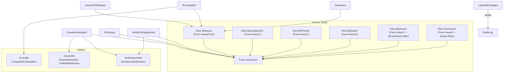

## Dependency Diagram (Mermaid)

```mermaid
flowchart TD
  subgraph Forms_Views
    F1["Form IssueForm"]
    V0["View AllIssues (Form=IssueForm)"]
    V1["View ByAssignedTo (Form=Issue?)"]
    V2["View ByPriority (Form=Issue?)"]
    V3["View ByStatus (Form=Issue?)"]
    V4["View MyIssues (Form=Issue? + @UserName filter)"]
    V5["View NewIssues (Form=Issue? + Status=New)"]
  end

  subgraph Utilities
    U1["IssueUtils\nGenerateIssueID, LinkRelatedIssues"]
    U2["NotificationUtils\nSendIssueNotification"]
    U3["SLAUtils\nComputeSLADeadline"]
  end

  A1["CreateIssueAgent"] --> U1
  A1 --> U2
  A1 --> F1

  A2["PostIssue"] --> F1
  A3["NotifyOnAssignment"] --> U2
  A3 --> F1
  A4["SLAUpdater"] --> U3
  A4 --> V0
  A5["IssuesJSONAgent"] --> V0
  A6["GetIssues"] --> V0
  A7["LogFieldChanges"] -->|"writes"| A8["AuditLog"]

  V0 --> F1
  V1 & V2 & V3 & V4 & V5 --> F1
```

