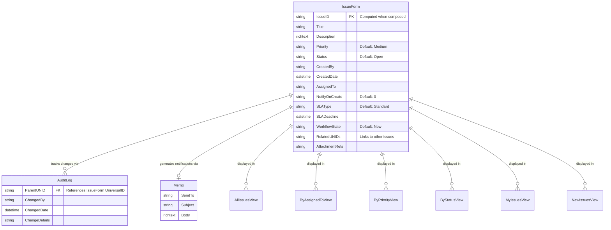

# Entity Relationship Diagram

## ERD for Issue Tracker Application

## Entity Descriptions

### IssueForm
Main entity representing an issue/ticket in the system. Contains all issue-related information including identification, description, assignment, SLA tracking, and workflow state.

**Key Fields:**
- `IssueID`: Unique identifier generated using `GenerateIssueID()` function (format: ISS-yyyymmdd-hhnnss-####)
- `Title`: Short description of the issue
- `Description`: Detailed description (rich text)
- `Priority`: Issue priority level (e.g., Low, Medium, High, Critical)
- `Status`: Current status (e.g., New, Open, In Progress, Resolved, Closed)
- `AssignedTo`: User assigned to handle the issue
- `SLAType`: SLA classification (Critical, Standard, Extended)
- `SLADeadline`: Calculated deadline based on SLAType and CreatedDate
- `RelatedUNIDs`: Links to related issues (self-referencing)
- `AttachmentRefs`: References to attached files

### AuditLog
Tracks field changes and modifications to IssueForm documents. Created by the LogFieldChanges agent when document fields are modified.

**Key Fields:**
- `ParentUNID`: Foreign key linking to the IssueForm's UniversalID
- `ChangedBy`: User who made the change
- `ChangedDate`: Timestamp of the change
- `ChangeDetails`: Description of what changed (currently placeholder)

**Relationship:**
- One-to-Many: One IssueForm can have multiple AuditLog entries

### Memo
Email notification document generated when issues are created or assigned. Created by NotificationUtils library.

**Key Fields:**
- `SendTo`: Recipient email address
- `Subject`: Email subject line
- `Body`: Email body content

**Relationship:**
- One-to-One: One IssueForm can generate one notification Memo (when NotifyOnCreate=1 or on assignment)

## View Relationships

All views display IssueForm documents filtered by different criteria:
- **AllIssuesView**: All IssueForm documents
- **ByAssignedToView**: Grouped by AssignedTo field
- **ByPriorityView**: Grouped by Priority field
- **ByStatusView**: Grouped by Status field
- **MyIssuesView**: Filtered by current user (@UserName) in AssignedTo
- **NewIssuesView**: Filtered by Status = "New"

## Notes

- IssueForm documents can reference other IssueForm documents via RelatedUNIDs (self-referencing relationship)
- AuditLog entries are created automatically when IssueForm fields change (via LogFieldChanges agent)
- Notifications (Memo) are created conditionally based on NotifyOnCreate flag or assignment changes
- Views are read-only representations of IssueForm data with different filtering/sorting criteria

