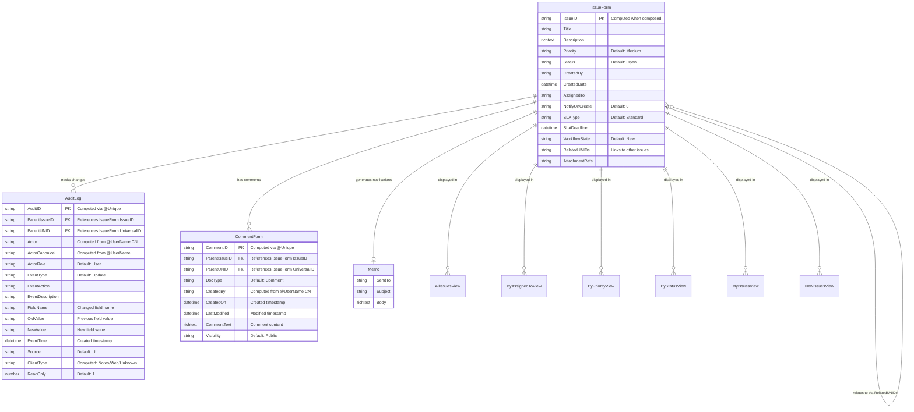

# Complete Entity Relationship Diagram

## ERD for Issue Tracker Application (Including AuditLog and CommentForm)

## Entity Descriptions

### IssueForm
Main entity representing an issue/ticket in the system. Contains all issue-related information including identification, description, assignment, SLA tracking, and workflow state.

**Key Fields:**
- `IssueID`: Unique identifier generated using `GenerateIssueID()` function (format: ISS-yyyymmdd-hhnnss-####)
- `Title`: Short description of the issue
- `Description`: Detailed description (rich text)
- `Priority`: Issue priority level (e.g., Low, Medium, High, Critical)
- `Status`: Current status (e.g., New, Open, In Progress, Resolved, Closed)
- `AssignedTo`: User assigned to handle the issue
- `SLAType`: SLA classification (Critical, Standard, Extended)
- `SLADeadline`: Calculated deadline based on SLAType and CreatedDate
- `RelatedUNIDs`: Links to related issues (self-referencing relationship)
- `AttachmentRefs`: References to attached files

**Relationships:**
- One-to-Many with AuditLog (tracks all field changes)
- One-to-Many with CommentForm (allows multiple comments per issue)
- One-to-Many self-referencing (issues can relate to other issues)
- One-to-One with Memo (conditional notification generation)

### AuditLog
Comprehensive audit trail entity that tracks all field-level changes and modifications to IssueForm documents. Created automatically by the LogFieldChanges agent when document fields are modified. Documents are read-only (immutable) once created.

**Key Fields:**
- `AuditID`: Unique identifier computed using `@Unique` formula
- `ParentIssueID`: Foreign key linking to the IssueForm's IssueID (human-readable reference)
- `ParentUNID`: Foreign key linking to the IssueForm's UniversalID (system reference)
- `Actor`: Display name of user who made the change (computed from @UserName CN)
- `ActorCanonical`: Canonical username (computed from @UserName)
- `ActorRole`: Role of the actor (default: "User")
- `EventType`: Type of event (default: "Update")
- `EventAction`: Specific action performed
- `EventDescription`: Human-readable description of the event
- `FieldName`: Name of the field that was changed
- `OldValue`: Previous value of the changed field
- `NewValue`: New value of the changed field
- `EventTime`: Timestamp when the change occurred (created timestamp)
- `Source`: Source of the change (default: "UI")
- `ClientType`: Client type that initiated the change (computed: Notes/Web/Unknown)
- `ReadOnly`: Flag indicating document is read-only (default: 1)

**Relationship:**
- Many-to-One: Multiple AuditLog entries can reference one IssueForm document
- Created automatically when IssueForm fields change via LogFieldChanges agent

### CommentForm
Entity representing user comments added to issues. Allows users to add contextual information, updates, or discussions related to an issue. Supports visibility settings (Public/Private).

**Key Fields:**
- `CommentID`: Unique identifier computed using `@Unique` formula
- `ParentIssueID`: Foreign key linking to the IssueForm's IssueID (human-readable reference)
- `ParentUNID`: Foreign key linking to the IssueForm's UniversalID (system reference)
- `DocType`: Document type identifier (default: "Comment")
- `CreatedBy`: Display name of user who created the comment (computed from @UserName CN)
- `CreatedOn`: Timestamp when comment was created
- `LastModified`: Timestamp when comment was last modified
- `CommentText`: Rich text content of the comment
- `Visibility`: Visibility setting (default: "Public", can be "Private")

**Relationship:**
- Many-to-One: Multiple CommentForm documents can reference one IssueForm document
- Users can add multiple comments to track issue discussions and updates

### Memo
Email notification document generated when issues are created or assigned. Created by NotificationUtils library using Notes mail functionality.

**Key Fields:**
- `SendTo`: Recipient email address
- `Subject`: Email subject line
- `Body`: Email body content (rich text)

**Relationship:**
- One-to-One: One IssueForm can generate one notification Memo (when NotifyOnCreate=1 or on assignment change)
- Created conditionally based on NotifyOnCreate flag or assignment changes via NotifyOnAssignment agent

## View Relationships

All views display IssueForm documents filtered by different criteria:
- **AllIssuesView**: All IssueForm documents (Form = "IssueForm")
- **ByAssignedToView**: Grouped by AssignedTo field (Form = "Issue")
- **ByPriorityView**: Grouped by Priority field (Form = "Issue")
- **ByStatusView**: Grouped by Status field (Form = "Issue")
- **MyIssuesView**: Filtered by current user (@UserName) in AssignedTo (Form = "Issue")
- **NewIssuesView**: Filtered by Status = "New" (Form = "Issue")

**Note:** There is a potential form name mismatch - AllIssuesView uses "IssueForm" while other views use "Issue". This should be verified for consistency.

## Relationship Summary

1. **IssueForm → AuditLog**: One-to-Many
   - One issue can have multiple audit log entries
   - Each audit entry tracks specific field changes
   - Audit logs are immutable (read-only)

2. **IssueForm → CommentForm**: One-to-Many
   - One issue can have multiple comments
   - Comments support visibility settings
   - Comments can be created and modified by users

3. **IssueForm → Memo**: One-to-One (conditional)
   - One issue can generate one notification memo
   - Only created when NotifyOnCreate=1 or on assignment change

4. **IssueForm → IssueForm**: One-to-Many (self-referencing)
   - Issues can reference other related issues via RelatedUNIDs
   - Enables issue linking and relationship tracking

## Notes

- **AuditLog** entries are created automatically when IssueForm fields change (via LogFieldChanges agent)
- **CommentForm** documents are user-created and can be modified until saved
- **Memo** documents are created conditionally based on notification settings
- Views are read-only representations of IssueForm data with different filtering/sorting criteria
- All foreign key relationships use both ParentIssueID (human-readable) and ParentUNID (system-level) for flexibility

