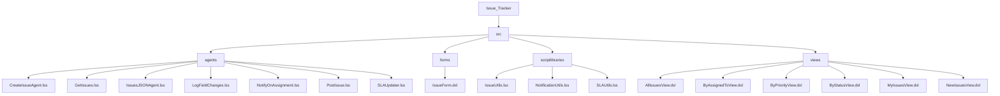

## Project Structure (Mermaid)

```mermaid
flowchart TD
  root["Issue_Tracker"]
  root --> src
  src --> agents
  src --> forms
  src --> scriptlibraries
  src --> views

  agents --> ACreate["CreateIssueAgent.lss"]
  agents --> AGet["GetIssues.lss"]
  agents --> AJSON["IssuesJSONAgent.lss"]
  agents --> ALog["LogFieldChanges.lss"]
  agents --> ANotify["NotifyOnAssignment.lss"]
  agents --> APost["PostIssue.lss"]
  agents --> ASLA["SLAUpdater.lss"]

  forms --> FIssue["IssueForm.dxl"]

  scriptlibraries --> LIssue["IssueUtils.lss"]
  scriptlibraries --> LNotif["NotificationUtils.lss"]
  scriptlibraries --> LSLA["SLAUtils.lss"]

  views --> VAll["AllIssuesView.dxl"]
  views --> VAssn["ByAssignedToView.dxl"]
  views --> VPrio["ByPriorityView.dxl"]
  views --> VStat["ByStatusView.dxl"]
  views --> VMy["MyIssuesView.dxl"]
  views --> VNew["NewIssuesView.dxl"]
```

