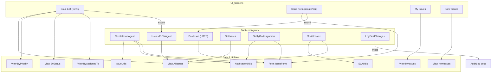

## Screens / Modules Mapping (Mermaid)

```mermaid
flowchart TD
  subgraph UI_Screens
    SList["Issue List (views)"]
    SForm["Issue Form (create/edit)"]
    SMy["My Issues"]
    SNew["New Issues"]
  end

  subgraph Backend_Agents["Backend Agents"]
    ACreate["CreateIssueAgent"]
    APost["PostIssue (HTTP)"]
    AJSON["IssuesJSONAgent"]
    AGet["GetIssues"]
    ANotify["NotifyOnAssignment"]
    ASLA["SLAUpdater"]
    ALog["LogFieldChanges"]
  end

  subgraph Data["Data & Utilities"]
    FIssue["Form IssueForm"]
    VAll["View AllIssues"]
    VAssn["View ByAssignedTo"]
    VPrio["View ByPriority"]
    VStat["View ByStatus"]
    VMy["View MyIssues"]
    VNew["View NewIssues"]
    UIssue["IssueUtils"]
    UNotif["NotificationUtils"]
    USLA["SLAUtils"]
  end

  %% Screen ↔ Data
  SList --> VAll
  SList --> VPrio
  SList --> VStat
  SList --> VAssn
  SMy --> VMy
  SNew --> VNew
  SForm --> FIssue

  %% Agents ↔ Data
  ACreate --> UIssue
  ACreate --> UNotif
  ACreate --> FIssue
  APost --> FIssue
  ANotify --> UNotif
  ANotify --> FIssue
  ASLA --> USLA
  ASLA --> VAll
  AJSON --> VAll
  AGet --> VAll
  ALog -->|"writes"| LogDoc["AuditLog docs"]

  %% Screens invoking Agents
  SForm -->|submit| APost
  SList -->|export| AJSON
```

